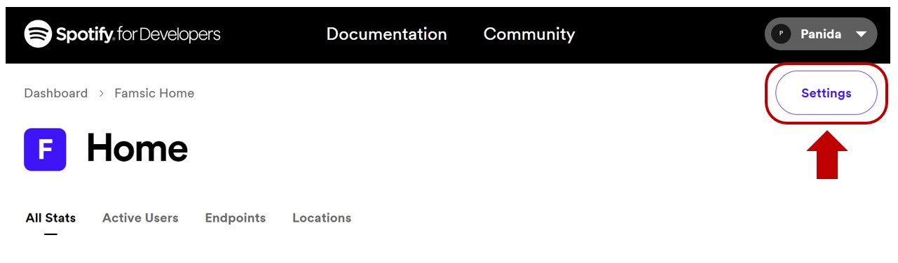

## About Famsic
A dynamic and responsive frontend web application which interacts with [Spotify Web API](https://developer.spotify.com/documentation/web-api).\
***Famsic*** allows users to view their playlists, search music, and create new playlists.\
The main goal of this project is to practice integrating Redux in React web.


## Built with
* [![React][React.js]][React-url]
* [![Redux][Redux.js]][Redux-url]

## Live Demo
https://famsic.onrender.com

## Features
* Users can view/search for their existing playlists
* Tracklists can be displayed for target playlist
* Users can search for music and create a new playlist


## Prerequisites
* npm
  ```sh
  npm install npm@latest -g
  ```
* Spotify account
  
  (Click [here](https://www.spotify.com/jp/signup) to sign up)


## Step-by-step Guides
1. Clone the repo
   ```sh
   git clone https://github.com/panida-pov/famsic.git
   ```
2. Install NPM packages 
   ```sh
   npm install
   ```
3. Log into [dashboard](https://developer.spotify.com/dashboard) using your Spotify account
4. [Create a new app](https://developer.spotify.com/documentation/web-api/concepts/apps) in the dashboard and set redirect URI like so:
   ```
   http://localhost:3000/
   ```
6. From [dashboard](https://developer.spotify.com/dashboard), navigate to your recently created app and click **"Setting"** to see the client ID

   

8. Insert your client ID in `Spotify.js`
   ```js
   const client_id = 'ENTER YOUR CLIENT ID HERE';
   ```
9. Run the project
   ```sh
   npm start
   ```


## How Famsic looks like
* Log in using Spotify account
 
  
  
* Show user's playlists
  
  
  
* Show tracklists of "Saturday Night" playlist
  
  

* Create a new playlist
  
  


## Acknowledgements
* [Spotify for Developers](https://developer.spotify.com/)
* [React Icons](https://react-icons.github.io/react-icons/)
* [Flaticon](https://www.flaticon.com/)


<!-- MARKDOWN LINKS & IMAGES -->
[React.js]: https://img.shields.io/badge/React-20232A?style=for-the-badge&logo=react&logoColor=61DAFB
[React-url]: https://reactjs.org/
[Redux.js]: https://img.shields.io/badge/redux-764ABC?style=for-the-badge&logo=Redux
[Redux-url]: https://redux.js.org/
